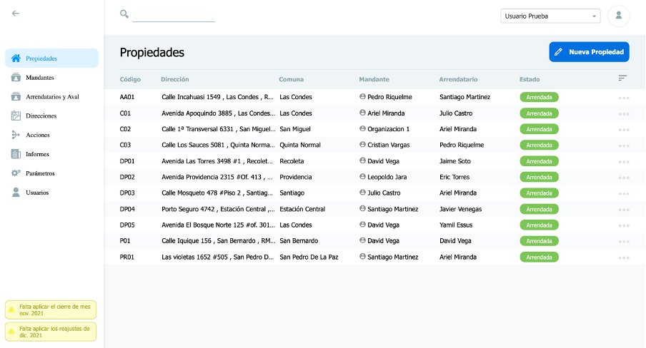
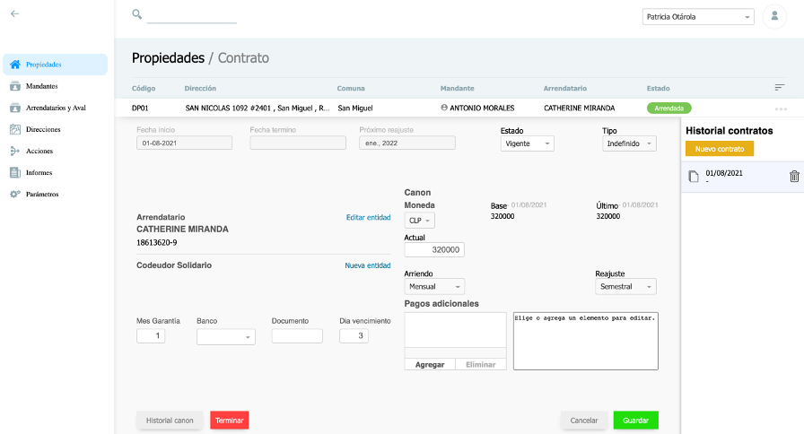
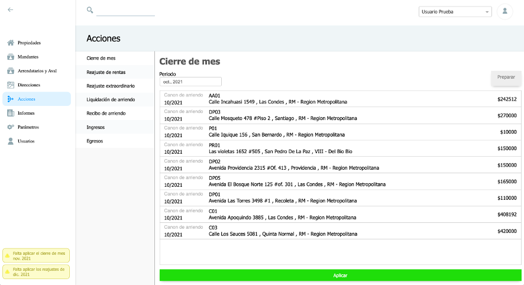
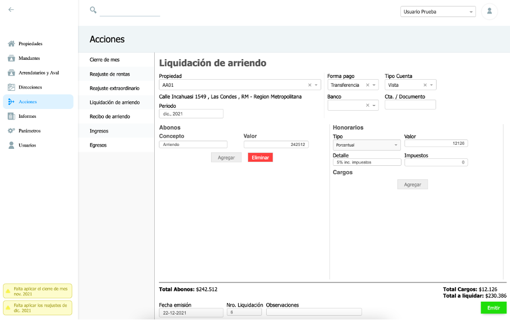

# ERP System Frontend

This repo contains the code to build the front-end of an ERP system for a small real-state office developed using AngularJS and Electron (later compiled for windows and MacOS users). The project was delivered in July 2021, code was uploaded in March 2024 for preservation.

## Screenshots
All text in the screenshots (as well as most table and queries) is in Spanish

#### Main view (registered properties)

#### Lease details

#### Monthly freeze
One of the requirements of the client was the ability to (manually) freeze balances after a month ended. This allowed them to account for unpayed periods but not overestimate inflation adjustments.

#### PDF report generation UI

